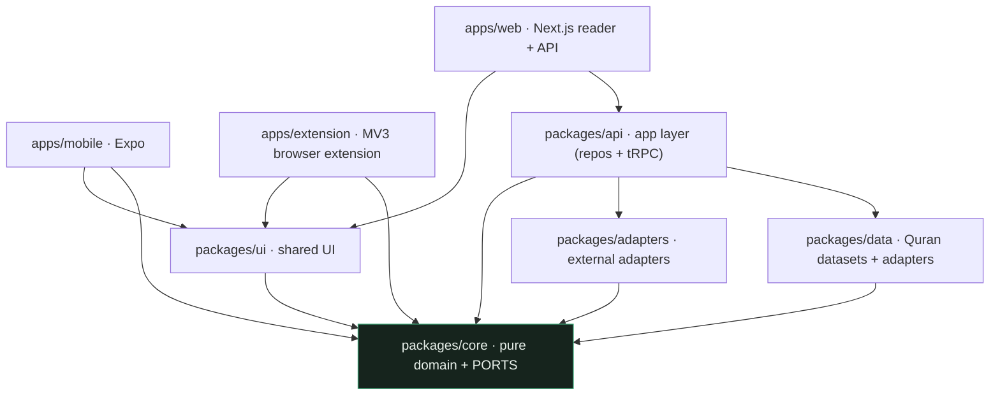
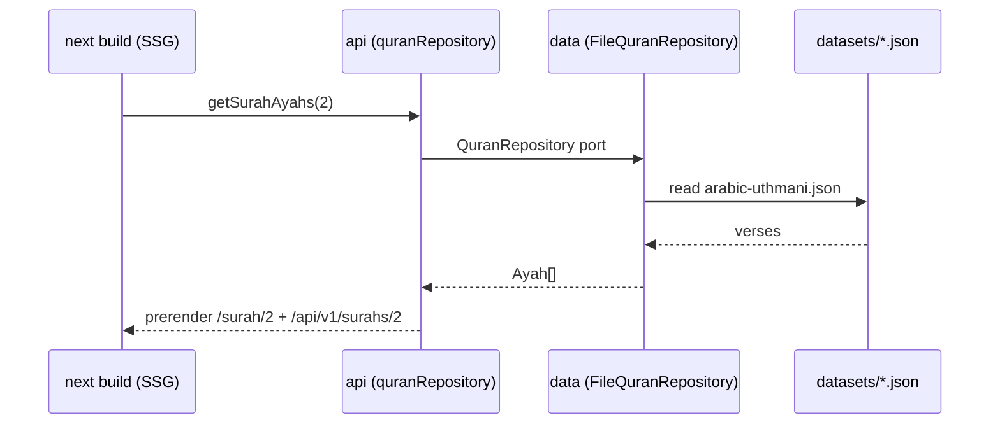
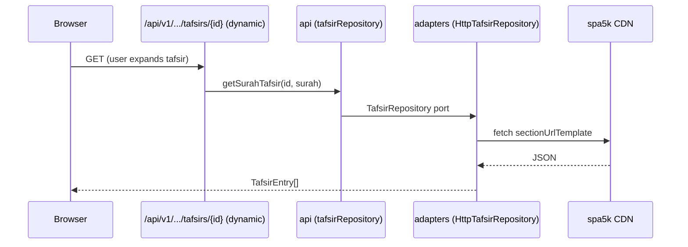
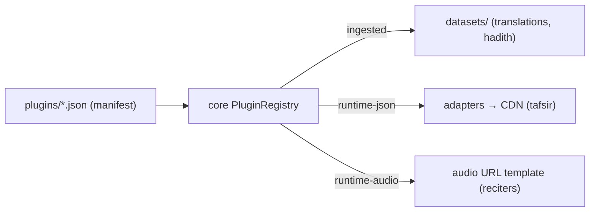

# Architecture

Qur’an Learn with Mahfuz is a **single TypeScript monorepo** (Turborepo + pnpm) built as a
**modular monolith** with **ports & adapters** (hexagonal). This document is the
map; the _why_ behind each decision lives in the [ADRs](docs/adr/).

## The one rule

**Dependencies point inward.** `apps` use `packages`; `packages` never use
`apps`; **`core` depends on nothing**. This is enforced in CI by
`eslint-plugin-boundaries` ([ADR 0001](docs/adr/0001-modular-monolith.md)).

`core` (highlighted) is the centre: it defines **entities** and **ports**
(interfaces); everything else either implements those ports or consumes them.

## Packages

The **`May depend on`** column below is current usage/intent, not all of it
lint-enforced at this granularity: `eslint-plugin-boundaries` enforces
`apps → any package`, `packages never → apps`, and `core → nothing` (see the
rule set in `eslint.config.mjs`), but it does **not** currently stop e.g.
`apps/mobile` from importing `packages/data` directly — nothing in the
codebase does that today, but the finer per-app restriction below is a
convention, not a CI-enforced boundary yet.

| Package           | Responsibility                                                                                                                                                             | May depend on              |
| ----------------- | -------------------------------------------------------------------------------------------------------------------------------------------------------------------------- | -------------------------- |
| **`core`**        | Pure domain: entities, structural invariants, SM-2 Hifz, plugin contract, **ports**. No framework, DB, network, or clock.                                                  | _nothing_                  |
| **`data`**        | Versioned Quran datasets (`datasets/`, generated by `scripts/ingest.ts`) + the file-backed `QuranRepository`/`TranslationRepository`, plus the plugin registry loader.     | `core`                     |
| **`adapters`**    | Concrete adapters for **external** concerns behind core ports: `HttpTafsirRepository`, `HttpHadithRepository`, `HttpTranslationCatalog`, `InMemoryHifzRepository`, `SqliteHifzRepository` (subpath), `AdhanPrayerTimes`. | `core`                     |
| **`api`**         | Application layer: wires the repositories and exposes the **tRPC `AppRouter`**. Apps depend on this, not on `data`/`adapters` directly.                                    | `core`, `data`, `adapters` |
| **`ui`**          | The **Noor design system** — themes, tokens and shared primitives, with `*.native.tsx` platform files so web and mobile render from one source ([ADR 0023](docs/adr/0023-noor-design-system.md), [0027](docs/adr/0027-generated-theme-css.md)). | `core`                     |
| **`apps/web`**    | Next.js App Router reader + the public REST/OpenAPI + tRPC endpoints (mostly statically generated) + the one runtime sync endpoint.                                        | `api`, `core`, `ui`        |
| **`apps/mobile`** | Expo / React Native app — the full reader and tools. Shares `core` + `ui`, reads the public REST API, persists via `AsyncStorage`/SQLite, and fires OS-level reminders through an `ExpoNotifier` ([ADR 0029](docs/adr/0029-mobile-notifier.md)). | `core`, `ui`               |
| **`apps/extension`** | MV3 browser extension (Vite); a thin popup client over the public REST API ([ADR 0026](docs/adr/0026-browser-extension.md)).                                            | `core`, `ui`               |

### `core` — the heart

- `entities.ts` — `Surah`, `Ayah`, `VerseKey`, `Translation`, `TafsirEntry`, `Hadith`, …
- `quran-structure.ts` — invariants (`TOTAL_AYAHS`, `AYAH_COUNTS`, `JUZ_STARTS`, `HIZB_STARTS`, `PAGE_STARTS`) + utils (`isValidVerseRef`, `juzNumberOf`, `pageNumberOf`, `pageRange`, …).
- `hifz.ts` — pure SM-2 scheduler ([ADR 0007](docs/adr/0007-hifz-spaced-repetition.md)).
- `plugins.ts` — the content-plugin contract + `PluginRegistry` ([ADR 0005](docs/adr/0005-content-plugin-system.md)).
- `languages.ts` / `translations.ts` — ISO-639 display names + pure grouping/filtering for the translation picker ([ADR 0010](docs/adr/0010-translation-selection.md)).
- `search.ts` — pure full-text ranking (`searchVerses`, `searchText`) with tashkeel-insensitive Arabic normalisation, powering Quran and Hadith search.
- `prayer.ts` — prayer-time domain: method/madhab catalogues (`CALCULATION_METHODS`, `MADHABS`), labels, and the pure clock-injected `nextPrayer(timings, now)` ([ADR 0012](docs/adr/0012-prayer-times.md)).
- `qibla.ts` — pure great-circle bearing to the Kaaba (`qiblaDirection`, `compassPoint`); no vendor, no port ([ADR 0013](docs/adr/0013-qibla.md)).
- `hijri.ts` — pure tabular Hijri↔Gregorian conversion (`gregorianToHijri`, `hijriToGregorian`, `HIJRI_MONTHS`, `formatHijri`) with a caller-supplied day adjustment ([ADR 0014](docs/adr/0014-hijri-calendar.md)).
- `zakat.ts` — pure zakat al-māl on monetary wealth (`calculateZakat`, `nisabValue`, `ZAKAT_ASSET_CATEGORIES`) with the niṣāb basis as a parameter ([ADR 0015](docs/adr/0015-zakat.md)).
- `reading-goals.ts` — pure reading-habit helpers: streaks, daily-goal progress, khatma pacing ([ADR 0006](docs/adr/0006-local-first-persistence.md)).
- `backup.ts` — pure local-backup envelope/validate/merge for `localStorage` export-import ([ADR 0018](docs/adr/0018-local-data-backup.md)).
- `adhkar.ts` / `duas.ts` — adhkar occasion catalogue + pure session-counter helpers (`filterByOccasion`, `nextTally`, `sessionProgress`), reminder windows derived from prayer timings, and the duʿā collection ([ADR 0016](docs/adr/0016-adhkar.md), [0017](docs/adr/0017-adhkar-reminders.md)); the `Dhikr` text is bundled content.
- `reading-plans.ts` — pure plan **schedule engine** + the bundled plan catalogue; a reader's progress is device-local via the `PlanStore` port ([ADR 0025](docs/adr/0025-reading-plans.md)).
- `prayer-tracker.ts`, `qada.ts`, `haid.ts`, `fasting-qada.ts` — pure trackers: the daily prayer log, the qaḍāʾ (missed-prayer) backlog, the ḥayḍ pause, and the make-up fasts derived from a ḥayḍ pause ∩ Ramaḍān ([ADR 0020](docs/adr/0020-prayer-tracker.md), [0030](docs/adr/0030-qada-tracker.md), [0031](docs/adr/0031-haid-pause.md), [0034](docs/adr/0034-fasting-qada.md)).
- `achievements.ts` — pure badge derivation over existing local data; only which badges were acknowledged is stored ([ADR 0032](docs/adr/0032-achievements.md)).
- `reminders.ts` — pure reminder orchestration (what to schedule, and when) feeding the `Notifier` port; the web adapter uses in-page timers, mobile an `ExpoNotifier` ([ADR 0019](docs/adr/0019-prayer-reminders.md), [0029](docs/adr/0029-mobile-notifier.md)).
- `sync.ts` / `sync-engine.ts` — pure HLC (hybrid logical clock) + last-writer-wins merge for the opt-in, end-to-end-encrypted sync; all crypto and transport stay behind ports ([ADR 0033](docs/adr/0033-account-sync.md)).
- `collections.ts`, `tasbih.ts`, `peek.ts`, `audio.ts`, `islamic-events.ts` — value types + pure helpers for ayah collections, the tasbih counter, hide-and-peek revision, audio segments, and Hijri events.
- `ports.ts` — **the interfaces** everything implements, in three families: **content repositories** (`QuranRepository`, `TranslationRepository`, `TafsirRepository`, `HadithRepository`, `AsmaRepository`, `AdhkarRepository`, `PlanCatalogPort`, `RecitationTimingRepository` — word-level recitation timings, [ADR 0036](docs/adr/0036-bundled-word-level-data.md)); **capability ports** (`PrayerTimesCalculator`, `Notifier`, `PrayerTimingsProvider`); and the **typed local-storage `*Store` ports** for every slice of device state (settings, library, goals, plan, prayer tracker, qaḍāʾ, ḥayḍ, fasting, achievements, tasbih, prayer settings, reminders — [ADR 0024](docs/adr/0024-local-storage-ports.md)), plus the sync seam (`Cipher`, `SyncBackend`, `SyncStateStore` — [ADR 0033](docs/adr/0033-account-sync.md)).

## Data flow

### Reading (build time)

Surah/juzʾ pages and the static REST endpoints are prerendered. Data is read at
**build** time, so there's no database and nothing dynamic at runtime
([ADR 0003](docs/adr/0003-static-first-delivery.md)).

### Runtime content — tafsir (on demand, in the browser)

Large content isn't bundled; tafsir is fetched on demand through a runtime
function ([ADR 0005](docs/adr/0005-content-plugin-system.md)).

Hadith is **not** on this path. Per [ADR 0022](docs/adr/0022-hadith-ingested-search.md)
it's ingested into `datasets/hadiths/*.json` at build time, same as
translations, and served by `FileHadithRepository` from `data` — it's on the
"reading (build time)" path above, plus a runtime read of the already-ingested
JSON for on-demand section fetches (`outputFileTracingIncludes` ships that
dataset slice to the function, see below). `HttpHadithRepository` still exists
in `adapters` but is unwired, superseded plumbing.

### User state (local-first, optional E2EE sync)

Bookmarks, Hifz progress, theme, reading prefs and every tracker live on the
device — `localStorage` on web, `AsyncStorage`/SQLite on mobile — reached only
through the typed `*Store` ports ([ADR 0006](docs/adr/0006-local-first-persistence.md),
[0024](docs/adr/0024-local-storage-ports.md)); a lint rule forbids raw storage
access outside an adapter ([ADR 0028](docs/adr/0028-persistence-enforcement.md)).
The Hifz UI drives the pure SM-2 engine in `core`.

There are still **no accounts and no server-side user data by default**. The one
exception is **opt-in, end-to-end-encrypted sync** ([ADR 0033](docs/adr/0033-account-sync.md)):
a recovery phrase derives the keys on-device, the client encrypts each `*Store`
value, and the single runtime endpoint `POST /api/sync` exchanges **opaque,
zero-PII ciphertext** — the server can identify a blob but never a person, and
never sees plaintext. Sync rides the same `*Store` seam, so the reader logic and
UI are unchanged whether sync is on or off.

### Content plugins — three delivery modes

Translations have **both** modes: a small ingested set (offline + REST API) and
the full runtime catalogue of ~490 editions fetched on demand from the
`fawazahmed0/quran-api` CDN ([ADR 0011](docs/adr/0011-translation-catalog-runtime.md)).

## Build & deploy

Push → GitHub Actions (lint · typecheck · test · build, Node 22) with module
boundaries enforced → Vercel deploys on merge to `main`. The output is ~1,560
static pages on the CDN (114 surahs, 30 juzʾ, 604 Mushaf pages, search, …) plus
a handful of dynamic serverless functions: tRPC, single-ayah, and the hadith
section route ship the ingested `datasets/` slice they read via
`outputFileTracingIncludes`; tafsir fetches from a CDN at request time so needs
no dataset tracing; `POST /api/sync` touches no dataset at all.

## Where to put things

See [`AGENTS.md`](AGENTS.md) for the decision table and the do/don't rules that
keep this structure intact.
