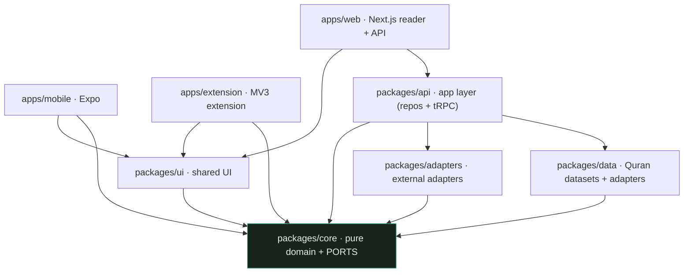
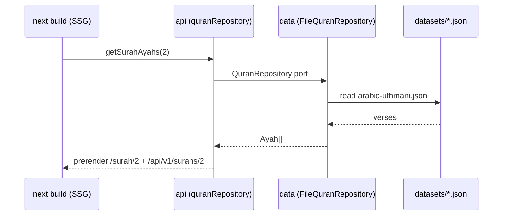

# Anatomy of an Open-Source Quran Platform

It reads the entire Quran in Arabic with translations in dozens of languages. It
computes prayer times for any coordinate on earth, points a compass at Mecca,
schedules your memorization review with a spaced-repetition algorithm, and — if you
opt in — syncs all of it across your phone, laptop, and browser extension without the
server ever being able to read a byte of it.

And it has no database.

[Qur’an Learn with Mahfuz](https://ummahlibrary.org) is an open-source Quran platform
(AGPL-3.0). This series takes it apart to show how it's built, because the way it's
built is worth stealing. This first article is the map: the shape of the codebase, the
one rule that holds it together, and where the deep-dives go from here.

## What you'll learn

- How a **modular monolith** in a single TypeScript monorepo scales to many features
  and many contributors without collapsing into a tangle — or fragmenting into
  microservices.
- The **dependency rule** at the centre of it, and why it's enforced by a linter
  instead of by code review.
- How to read the codebase: where domain logic lives, where the outside world is
  allowed in, and how a single request flows through the layers.

## One repo, six packages, three apps

Everything lives in one [pnpm](https://pnpm.io/) workspace, orchestrated by
[Turborepo](https://turbo.build/). The workspace globs are as boring as you'd hope:

```yaml
# pnpm-workspace.yaml
packages:
  - "apps/*"
  - "packages/*"
```

`apps/` holds the things a user opens; `packages/` holds the things those apps are
built from.

```
apps/
  web/        Next.js reader + the public API (the live site)
  mobile/     Expo / React Native app — the full reader + tools
  extension/  MV3 browser extension — a popup over the public API
packages/
  core/       Pure domain — Quran model, structural rules, and PORTS. No framework, no DB.
  data/       Ingested Quran datasets + adapters that serve them through core ports.
  api/        Application layer — repositories wired together + a tRPC router.
  adapters/   Concrete adapters for external concerns (HTTP content, prayer maths, audio, SQLite).
  ui/         The Noor design system — themes, tokens, shared component primitives.
```

Three user-facing apps, one shared brain. The mobile app is not a rewrite of the web
app's logic; the extension is not a third copy. They import the same `core` and render
the same design system. That's the whole game: **write the domain once, present it
three ways.**

## The one rule

If you remember one thing about this codebase, remember the direction of its arrows.

> **Dependencies point inward.** `apps` may use `packages`; `packages` may never use
> `apps`; and **`core` depends on nothing at all.**

This is the ports-and-adapters pattern (also called hexagonal architecture), and it's
recorded in [ADR 0001](../adr/0001-modular-monolith.md). Here is the actual dependency
graph, straight from the repo's `ARCHITECTURE.md`:



Notice that every arrow eventually points at `core`, and no arrow leaves it. `core`
is the centre. It defines the **entities** (`Surah`, `Ayah`, `VerseKey`, `Hadith`…)
and the **ports** — interfaces like `QuranRepository` and `PrayerTimesCalculator`.
Everything else in the system either *implements* one of those interfaces or *consumes*
it. Nothing in `core` knows whether the Quran text comes from a file, an HTTP call, or
a SQLite table; it only knows the shape of the answer.

The payoff of that constraint is the subject of the next two articles, so I'll keep it
to a sentence here: **because the domain depends on nothing, it can be tested in
isolation, shared across every platform, and outlive whatever framework is fashionable
this year.** The frameworks live at the edges, behind the ports, where they can be
swapped without the middle noticing.

## How a request actually flows

Abstractions are easier to trust when you can trace one concrete path through them. Say
a build worker needs the text of Surah 2 (Al-Baqarah, "The Cow"). Here's the trip:



The `api` package holds the wiring. It picks which concrete implementation stands
behind each port — and it reads like a list of decisions:

```typescript
// packages/api/src/repositories.ts (excerpt)
export const quranRepository: QuranRepository = new FileQuranRepository();
export const translationRepository: TranslationRepository = new FileTranslationRepository();
export const tafsirRepository: TafsirRepository = new HttpTafsirRepository(pluginRegistry);
export const hadithRepository: HadithRepository = new FileHadithRepository();
export const prayerTimes: PrayerTimesCalculator = new AdhanPrayerTimes();
```

Look at the types. Every left-hand side is a `core` interface; every right-hand side
is a concrete adapter. The Quran text comes from a **file** (`FileQuranRepository`),
tafsir (classical commentary) is fetched over **HTTP** at runtime
(`HttpTafsirRepository`), prayer times are computed by a **third-party astronomy
library** wrapped in `AdhanPrayerTimes`. The rest of the application — every page,
every API route — depends only on the interface on the left. Swap a right-hand side
and nothing above notices.

That same wiring is exposed two ways, so two very different consumers can share one
implementation ([ADR 0004](../adr/0004-public-api.md)): a **tRPC** router for
end-to-end type safety inside our own TypeScript apps, and a plain **REST** API for
everyone else.

```typescript
// packages/api/src/trpc.ts (excerpt)
export const appRouter = t.router({
  listSurahs: t.procedure.query(() => quranRepository.listSurahs()),

  getSurah: t.procedure.input(z.object({ number: surahNumber })).query(async ({ input }) => {
    const [surah, ayahs] = await Promise.all([
      quranRepository.getSurah(input.number),
      quranRepository.getSurahAyahs(input.number),
    ]);
    return surah ? { surah, ayahs } : null;
  }),
  // …
});

export type AppRouter = typeof appRouter;
```

The mobile app imports that `AppRouter` *type* and gets fully-checked API calls for
free. A stranger's Python script hits `GET /api/v1/surahs/2` and gets the same data as
static JSON. One set of repositories, two surfaces.

## What lives in the middle

`core` is where the interesting, transferable engineering is, so it's worth seeing how
much of the product is *pure logic with no I/O*. The package's barrel file is a table
of contents for the domain:

```typescript
// packages/core/src/index.ts (excerpt)
export * from "./quran-structure"; // 6,236-ayah invariants + juz/hizb/page lookups
export * from "./hifz";            // the SM-2 memorization scheduler
export * from "./search";          // tashkeel-insensitive full-text ranking
export * from "./prayer";          // prayer-time domain (methods, madhabs, next-prayer)
export * from "./qibla";           // great-circle bearing to the Kaaba
export * from "./hijri";           // Gregorian ↔ Islamic calendar arithmetic
export * from "./zakat";           // zakat-al-mal calculation
export * from "./sync";            // hybrid logical clock + merge for E2EE sync
// …and two dozen more
```

Every one of those modules is a plain function library: give it inputs, get outputs,
no side effects. The memorization scheduler doesn't know what a database is. The
prayer-time helpers don't read the system clock — you *pass them* the current time.
The search ranker is a pure function over an array. Roughly thirty modules, and nearly
every one ships with a co-located unit-test file, because pure functions are trivial to
test. (That "pass in the clock" habit is small but load-bearing;
[article 3](03-a-pure-core.md) is entirely about it.)

Two Arabic terms you'll meet throughout, defined once: an **ayah** is a verse; a
**surah** is a chapter. The Quran has 114 surahs and 6,236 ayahs, and those two numbers
are treated as invariants the build checks against — more on that in
[article 11](11-provenance-as-architecture.md).

## The decisions are written down

One more thing that makes this codebase unusual, and unusually easy to join: it
explains itself. The [`docs/adr/`](../adr/) directory holds three dozen **Architecture
Decision Records** — short documents, each in the same shape (Context → Decision →
Consequences), that capture *why* a choice was made and what it cost.

They are not marketing. They argue with each other. [ADR 0012](../adr/0012-prayer-times.md)
sets up a pattern for prayer times; [ADR 0013](../adr/0013-qibla.md) turns around and
says that pattern was the wrong shape for the qibla and explains why. That thread is so
instructive it gets [its own article](04-when-not-to-add-a-port.md). The point for now:
when you want to understand any part of this system, there is almost always a numbered
record telling you what the author was thinking. That's a rare gift in open source, and
it's why this series can cite a *reason* for nearly every claim it makes.

## Where this series goes

The rest of the series follows the arrows inward and then back out:

- **[The One Rule That Protects Everything](02-the-one-rule-that-protects-everything.md)** —
  how a single ESLint rule enforces the dependency direction, and why that replaces a
  hundred code-review arguments.
- **[A Pure Core](03-a-pure-core.md)** — why `Date.now()` is a *build error* inside
  `core`, and what determinism buys you.
- **[When *Not* to Add a Port](04-when-not-to-add-a-port.md)** — the discipline of
  *not* abstracting, told through two ADRs that disagree.
- **[Local-First Software People Own](05-local-first-software-people-own.md)** and
  **[Encrypting Data You Can Never Read](06-encrypting-data-you-can-never-read.md)** —
  no accounts, no tracking, and an optional sync where the server is a blind ciphertext
  box.
- **[Delete the Database](07-delete-the-database.md)**, **[One Domain, Three Apps](08-one-domain-three-apps.md)**,
  **[Plug It In](09-plug-it-in.md)**, **[Searching Arabic in the Browser](10-searching-arabic-in-the-browser.md)**,
  and **[Provenance as Architecture](11-provenance-as-architecture.md)** — the
  static-first delivery model, cross-platform sharing, the content-plugin system,
  on-device Arabic search, and how a software *licence* can dictate system design.
- **[Your First Contribution](12-your-first-contribution.md)** — the on-ramp, end to
  end.

## The invitation

Here's the thing about a codebase with arrows this strict: it's hard to break by
accident. If you try to import a database driver into `core`, or reach past the API
straight into the data layer, the build stops you before a human ever sees the PR. For
a newcomer, that's not a barrier — it's a safety net. The structure tells you where
your code goes, and catches you when you guess wrong.

Qur’an Learn with Mahfuz is AGPL-3.0, owned by no one, and built as a *Sadaqah Jariyah* — an
ongoing charity. If you want to see how the pieces fit before you touch anything, the
best next reads are [`ARCHITECTURE.md`](../../ARCHITECTURE.md) (this map, in more
detail) and [`AGENTS.md`](../../AGENTS.md) (a decision table for *where does this code
go?*). When you're ready, [`CONTRIBUTING.md`](../../CONTRIBUTING.md) is the front door.

Next up: [the one rule that makes all of this hold](02-the-one-rule-that-protects-everything.md).
